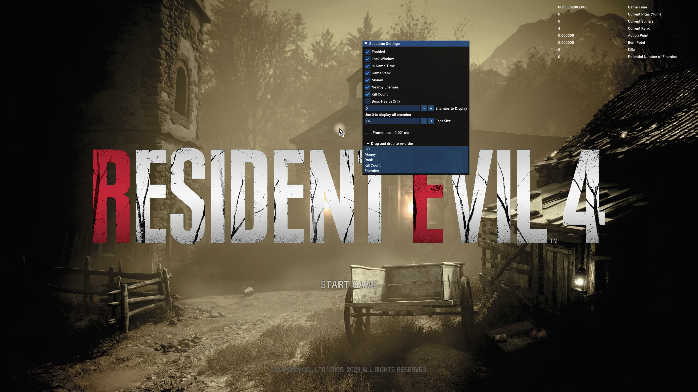
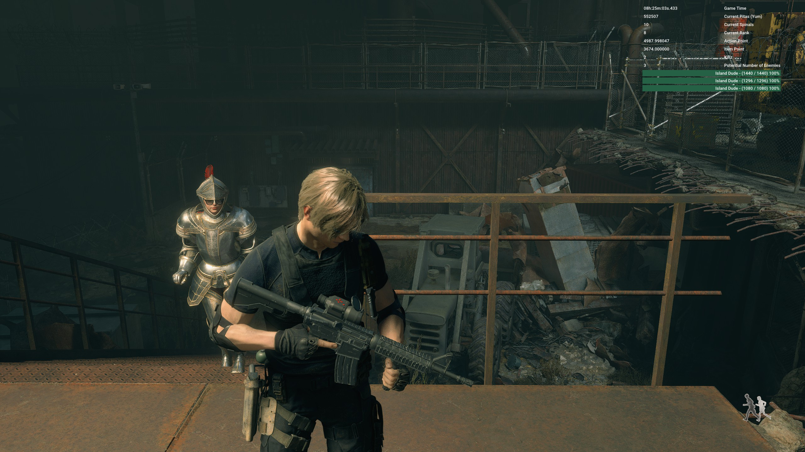

## Resident Evil Speedrun Overlay

This is a (mostly) rewritten plugin using the [reframework](https://github.com/praydog/REFramework) to provide informational assistance
to speed runners of Resident Evil 4 remake.

Currently, the plugin provides
1. In game time
2. Game Rank (DA)
3. Pesetas
4. Spinels
5. Nearby enemies and their health bars (Enemies are sorted by their current health value, the highest first)
6. Current Chapter Kill Count
7. Distance between your character and your companion
8. Font Size scaling
9. Only display boss health bars
10. Only display X number of enemy health bars

### Installation
1. Install the [reframework](https://github.com/praydog/REFramework#installation)
2. Go to the [releases](https://github.com/hntd187/re-speedrun-overlay/releases) page and download a release of the plugin and place the file in your `<GAME DIRECTORY>/reframework/plugins/`

### Additional Credits
Additional code and credit to Preydog and Cursey, some example code was taken from their work in [kananlib](https://github.com/cursey/kananlib/) and 
reframework's plugin [example](https://github.com/praydog/REFramework/tree/master/examples/example_plugin).

### Screenshots

